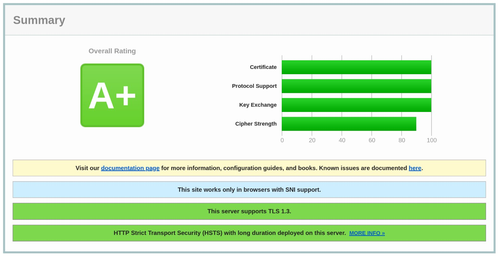

[](LICENSE) []()

# **[Cloud Skeleton][cloud-skeleton]** ► **[Packs Registry][packs-registry]**  ► **reverse_proxy**

## Overview

> **IMPORTANT:** Before deploying any **[Nomad Packs][hashicorp-nomad-packs]**, **you must complete all the prerequisites detailed in the **[Cloud Skeleton][cloud-skeleton]** ► **[Prerequisites][prerequisites]** repository.** This step is essential to ensure that your system meets all the required configurations, dependencies, and security measures necessary for a successful deployment.

**Traefik HTTP reverse proxy and load balancer.**  
A robust reverse proxy setup using **[Traefik][traefik]** to:
- Manage incoming HTTP/HTTPS traffic.
- Securely route requests to backend services.
- Automate TLS certificate management via **[Let's Encrypt][lets-encrypt]**.
- Serve a regularly updated `security.txt` file for transparency and secure communication.
- Deliver an A+ SSL configuration as verified by **[SSL Labs][ssl-labs]**.



## Table of Contents

- [Compatibility & Requirements](#compatibility--requirements)
  - [Generic Requirements](#generic-requirements)
  - [Security Requirements](#security-requirements)
- [Configuration](#configuration)
  - [Pack Variables](#pack-variables)
  - [Example `vars.hcl`](#example-varshcl)
- [Pack Layout](#pack-layout)
- [Services & Ports](#services--ports)
- [Storage](#storage)
- [Contributing](#contributing)
- [License](#license)

## Compatibility & Requirements

### Generic Requirements

| Component      | Requirement / Note                        |
|----------------|-------------------------------------------|
| Resources      | **CPU:** 100 MHz <br> **RAM:** 64 MB      |
| Namespace(s)   | `system`                                  |
| Node class(es) | `ingress-worker`                          |
| CSI volumes    | ✅                                        |
| Ingress        | ✅                                        |

### Security Requirements

| Component          | Requirement / Note |
|--------------------|--------------------|
| Privileged         | ❌                 |
| Extra capabilities | ❌                 |

## Configuration

### Pack Variables

| Variable              | Type                                                         | Default | Required | Description                                                                                                         |
|-----------------------|--------------------------------------------------------------|---------|----------|---------------------------------------------------------------------------------------------------------------------|
| `certificates_volume` | *object({ id = string, name = string, plugin_id = string })* |         | ✅       | CSI volume object used to store and share TLS certificates for the ingress load balancer (Traefik).                 |
| `hostname`            | *string*                                                     |         | ✅       | The hostname (FQDN) used to access the Traefik dashboard. This is the domain that Traefik will serve its web UI on. |
| `id`                  | *string*                                                     |         | ✅       | Unique identifier used to distinguish multiple deployments of this pack with different variables.                   |

#### Example `vars.hcl`

```hcl
# CSI volume object used to store and share TLS certificates for the ingress load balancer (Traefik).
certificates_volume = {
  id        = "reverse_proxy-certificates"
  name      = "reverse_proxy/certificates"
  plugin_id = "nas"
}

# The hostname (FQDN) used to access the Traefik dashboard. This is the domain that Traefik will serve its web UI on.
hostname = "lb.cluster.domain.com"

# Unique identifier used to distinguish multiple deployments of this pack with different variables.
id = "main"
```

### Nomad Variables (Parameters)

| Job                       | Variable | Key              | Default          | Description                                                                                                      |
|---------------------------|----------|------------------|------------------|------------------------------------------------------------------------------------------------------------------|
| **ingress_load_balancer** | `config` | `admin_ip_cidrs` | "[]"             | JSON array of CIDRs allowed to access the Traefik dashboard (IPAllowList middleware). Example: `["1.2.3.4/32"]`. |
| **ingress_load_balancer** | `config` | `log_level`      | "INFO"           | Traefik log verbosity. Valid values: `TRACE`, `DEBUG`, `INFO`, `WARN`, `ERROR`, `FATAL`, `PANIC`.                |
| **ingress_load_balancer** | `config` | `ssllabs_cidr`   | "69.67.183.0/24" | CIDR allowed to hit the special SSL Labs validation route. Used by the `ssllabs-certificate-validation` router.  |
| **ingress_load_balancer** | `dns`    | `CODE`           |                  | ACME DNS challenge provider code for Traefik (e.g., `"cloudflare"`, `"route53"`).                                |
| **ingress_load_balancer** | `dns`    | `{dynamic}`      |                  | Provider-specific env vars rendered into the task (e.g., `CLOUDFLARE_DNS_API_TOKEN`, `AWS_ACCESS_KEY_ID`, etc.). |
| **ingress_load_balancer** | `images` | `traefik`        | "3.5.2"          | Traefik container image **tag** used by the job (repository is the key; tag is the value).                       |

## Pack Layout

```
packs/job_watchdog/
├─ metadata.hcl
├─ outputs.tpl
├─ README.md
├─ templates/
│  ├─ watcher.nomad.tpl
│  └─ _vars.tpl
├─ variables.hcl
└─ vars/
   └─ example.var.hcl
```

## Services & Ports

| Service Name                                | Port Name | Source Port | Destination Port    | Description                                         |
|---------------------------------------------|-----------|-------------|---------------------|-----------------------------------------------------|
| `reverse-proxy-ingress-load-balancer-${id}` | http      | 80          | `$NOMAD_PORT_http`  | HTTP entrypoint; redirects to HTTPS.                |
| `reverse-proxy-ingress-load-balancer-${id}` | https     | 443         | `$NOMAD_PORT_https` | Primary HTTPS entrypoint; health check `GET /ping`. |

## Storage

| Mount Path                 | Access Mode | Type | Description                                         |
|----------------------------|-------------|------|-----------------------------------------------------|
| `/certificates`            | Read-write  | CSI  | Persistent store for Traefik ACME data (acme.json). |
| `/etc/traefik/dynamic.yml` | Read-only   | Bind | Traefik dynamic configuration.                      |
| `/etc/traefik/traefik.yml` | Read-only   | Bind | Traefik static configuration.                       |

## Contributing

Contributions and improvements to this installation script are welcome!  
- Fork the repository.  
- Create a new branch (e.g., **`feature/my-improvement`**).  
- Submit a pull request with your changes.

## License

This project is licensed under the [GNU General Public License v3.0](LICENSE).

---

*This repository is maintained exclusively by the **[Cloud Skeleton][cloud-skeleton]** project, and it was developed by EU citizens who are strong proponents of the European Federation. 🇪🇺*

<!-- Reference -->
[cloud-skeleton]: https://github.com/cloud-skeleton/
[hashicorp-nomad]: https://developer.hashicorp.com/nomad/tutorials/get-started
[hashicorp-nomad-packs]: https://developer.hashicorp.com/nomad/tools/nomad-pack
[lets-encrypt]: https://letsencrypt.org/getting-started/
[packs-registry]: https://github.com/cloud-skeleton/packs-registry/
[prerequisites]: https://github.com/cloud-skeleton/prerequisites
[ssl-labs]: https://www.ssllabs.com/ssltest/
[traefik]: https://doc.traefik.io/traefik/